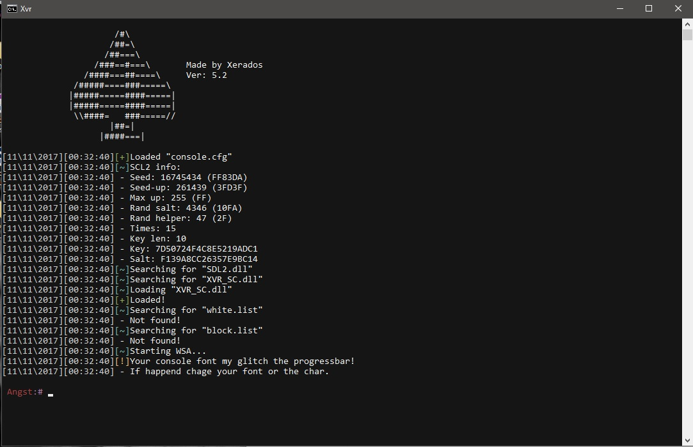
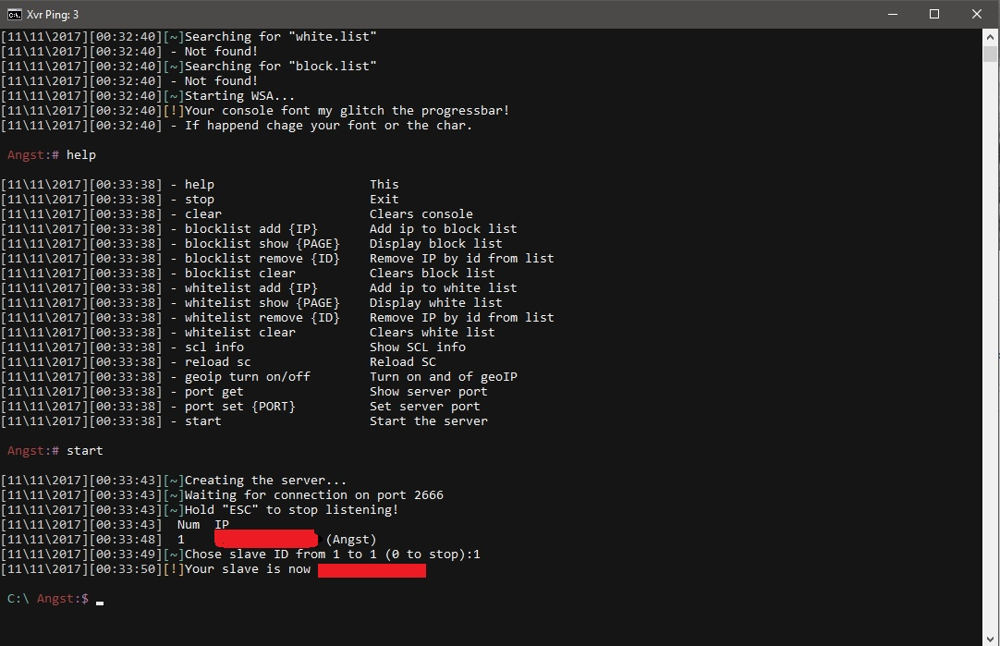
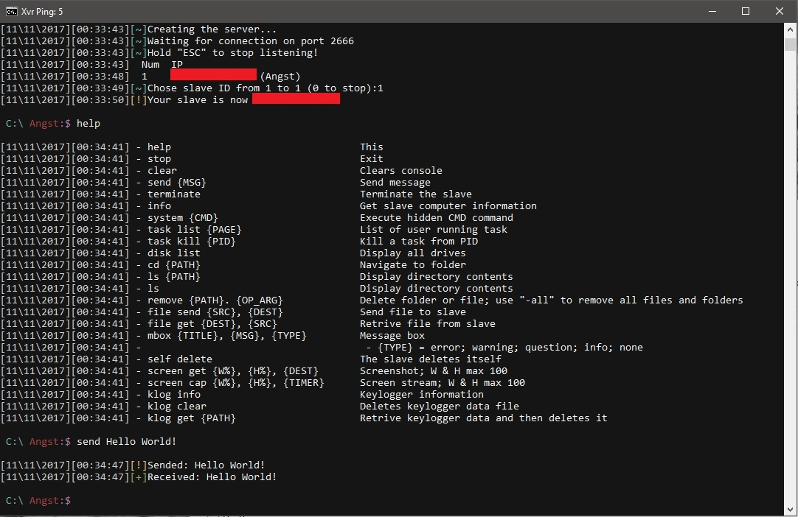
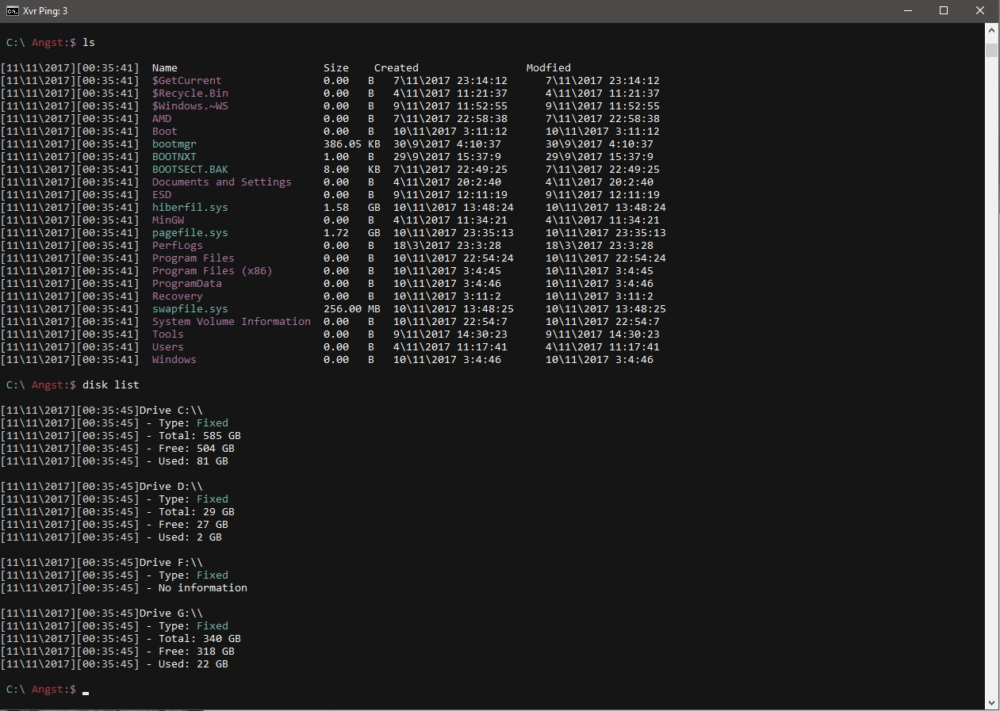

# XVR-Trojan 5.2
 - Still under development, You can do what you wan't with the code
 - Made it more customizable and protected
 - There may be some bugs that need fixing so you known!
 - On the infector i am still working and how it will work so for know there isn't a working infector
 - Tested on windows 10 on windows 7 if the video drivers aren't updated you will fail to take a screenshot and the infector isn't tested fully
 - On some point i will add a custom console cuz the cmd.exe is slow and limited...
 
# Slave
 - The data in "memProtect.c" is generated by the program (bin\PROG.exe) in memProtect in slave forlder
 - To make the slave connect with your master use this folder memProtect and generate your ip and add it in memProtect.c you will see a comment "//You't master IP/DNS"

You can start the program with two options
 - -Time for displaying time
 - -Color for colorful console

Tools used
 - MinGW http://mingw.org
 - Dr.Memory http://www.drmemory.org
 - SDL2 https://www.libsdl.org/download-2.0.php
 - OlyDbg http://www.ollydbg.de
 
# NOTE:
 - I don't know english very well so there may be some grammatical errors

Here are some images

  

  
  
  
  
  
