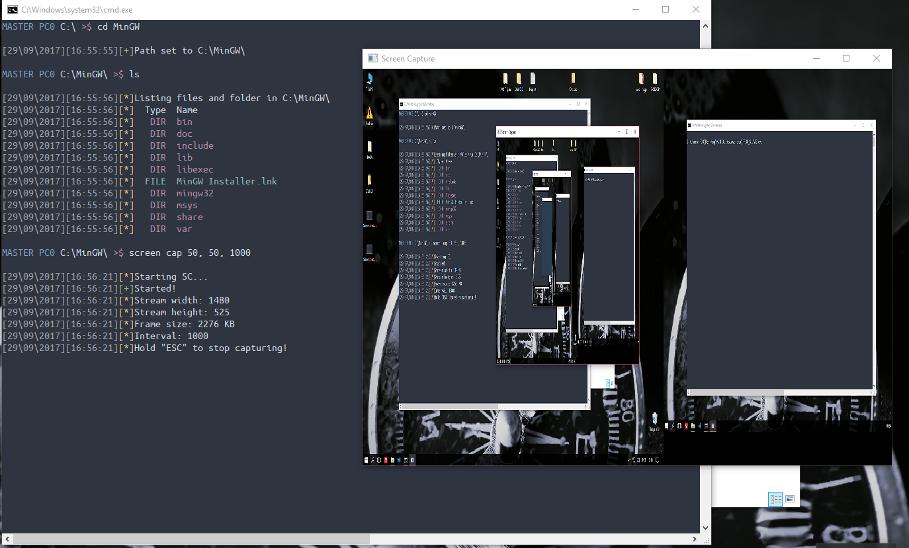

# XVR-Trojan
- Tested and runs on windows 10, on windows 7 some commands may not work properly
- You can do what you wan't with the code
- I programmed it just for fun

You can start the program with two options..
 - -Time for displaying time
 - -Color for colorful console
 - -GeoIP to display slaves country names
 
Compiled with MinGW, for debuging using  "drmemory" http://www.drmemory.org and for the Scren capture using SDL2 https://www.libsdl.org/download-2.0.php
the master will generate "colors.cfg" if he can't find it, and if don't like the setted colors you can chage them from the file.

# NOTE:
- I don't know english very well so there may be some grammatical errors
- The color values in "colors.cfg" are the same as in Command Prompt, just in 10 base system... so 0xF0 is white background and white foreground witch in 10 base system is 240. If you wan't tha slave to infect, in the slave folder in main.c uncomment line 14

Here are some images

  

  
  
  
  
  
